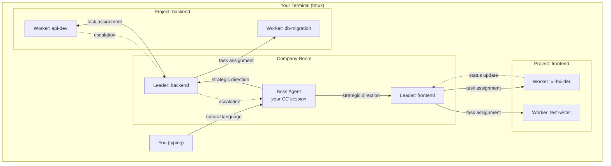
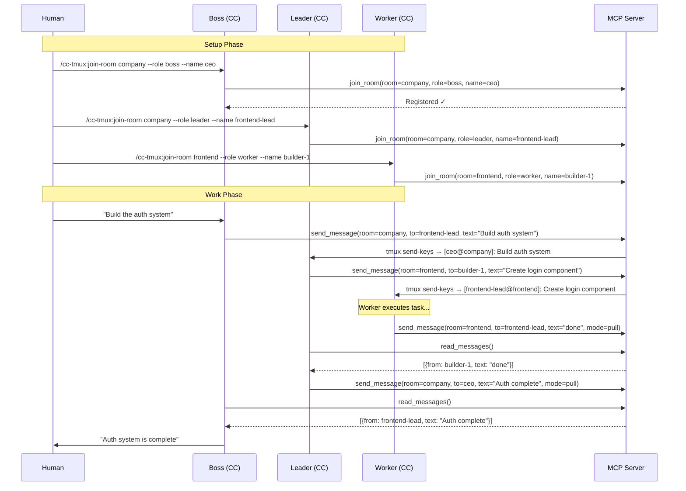
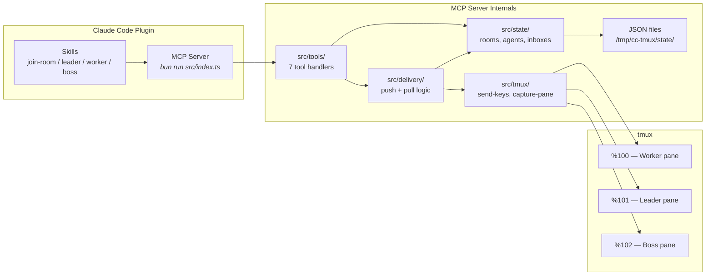
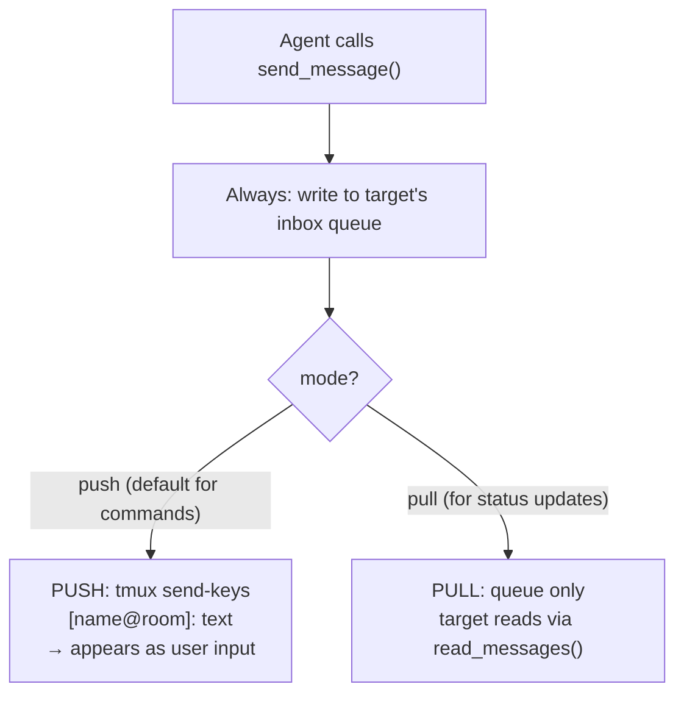
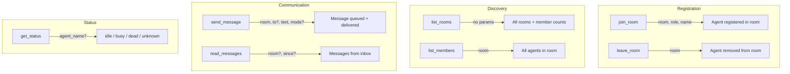
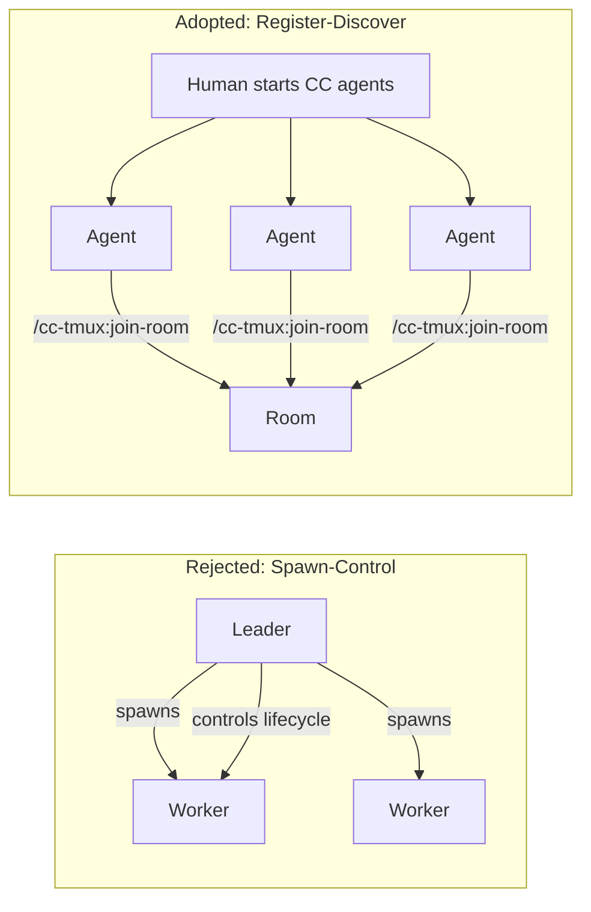
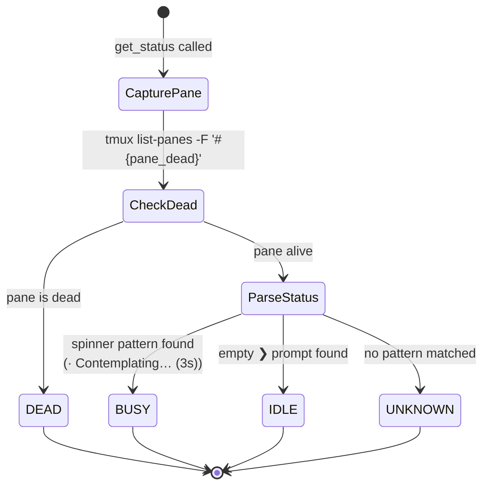
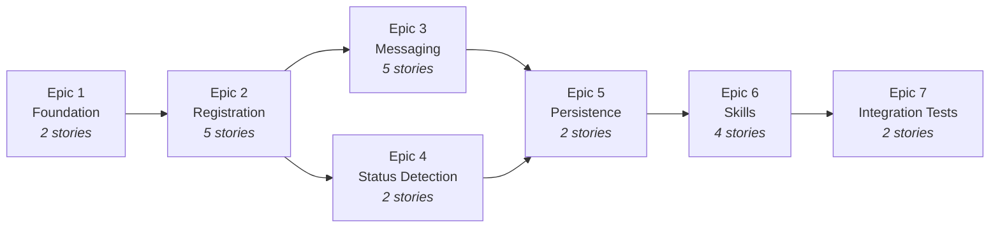
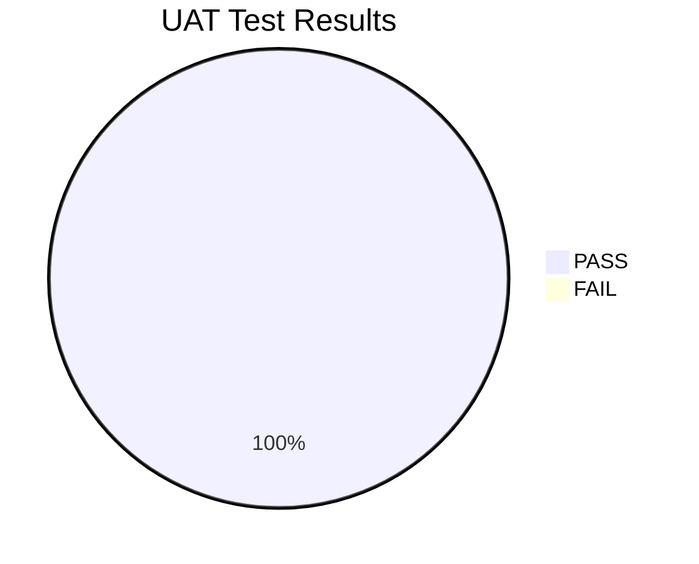
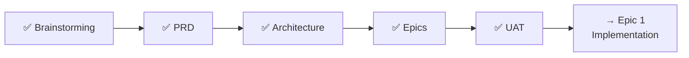

# cc-tmux Session Report

**Date:** 2026-04-05
**Duration:** ~3 hours
**Method:** Monitor agent proxied user with BMad brainstorming agent via tmux, then ran UAT

---

## What is cc-tmux?

A Claude Code plugin that turns your terminal into an AI development team. You start multiple Claude Code sessions in tmux panes, register them into "rooms" with roles, and they coordinate autonomously.



**Key insight:** The human's own Claude Code session IS the boss. No dashboards, no separate monitoring tools. You stay in your terminal, in your flow.

---

## How It Works



---

## Architecture



### Dual-Mode Messaging

The system has two delivery modes to solve the interrupt-vs-poll tradeoff:



| Mode | When to use | Delivery | Example |
|------|-------------|----------|---------|
| **Push** | Commands, urgent tasks | tmux send-keys + queue | Leader assigns task to worker |
| **Pull** | Status updates, non-urgent | Queue only | Worker reports "task complete" |

---

## MCP Tool API (7 tools)



| Tool | Params | Returns |
|------|--------|---------|
| `join_room` | `room`, `role` (boss/leader/worker), `name` | `{ agent_id, name, role, room, tmux_target }` |
| `leave_room` | `room` | `{ success: true }` |
| `list_rooms` | — | `{ rooms: [{ name, member_count, roles }] }` |
| `list_members` | `room` | `{ room, members: [{ name, role, status }] }` |
| `send_message` | `room`, `to?`, `text`, `mode?` | `{ message_id, delivered, queued }` |
| `read_messages` | `room?`, `since_sequence?` | `{ messages: [...], next_sequence }` |
| `get_status` | `agent_name?` | `{ name, role, status, last_activity_ts }` |

---

## Design Decisions

### Why tmux?

- Already on every developer's machine
- Survives SSH disconnects (agents keep working)
- `send-keys` = inject input, `capture-pane` = read output
- Zero infrastructure — no servers, APIs, or databases

### Why rooms instead of direct spawn?



**Register-Discover wins because:**
- Human controls which agents exist (security boundary)
- Agents are autonomous participants, not spawned processes
- Rooms map to real team structure (project teams, company leadership)
- Spawn preserved as optional Phase 2 feature

### How status detection works



Regex patterns (empirically validated via UAT):

| State | Pattern | Example |
|-------|---------|---------|
| **Idle** | `^❯\s*$` | `❯` (empty prompt) |
| **Busy** | `/^[·*✶✽✻]\s+\w+…\s+\(\d/` | `· Contemplating… (3s)` |
| **Complete** | `/^✻\s+\w+\s+for\s+/` | `✻ Baked for 1m 2s` |
| **Dead** | `#{pane_dead}` via tmux | pane no longer exists |

---

## Project Structure

```
cc-tmux/
├── .claude-plugin/
│   └── plugin.json              # Plugin manifest
├── skills/
│   ├── join-room/SKILL.md       # /cc-tmux:join-room slash command
│   ├── leader/SKILL.md          # Leader coordination patterns
│   ├── worker/SKILL.md          # Worker task handling
│   └── boss/SKILL.md            # Boss management patterns
├── .mcp.json                    # bun run src/index.ts
├── src/
│   ├── index.ts                 # MCP server entrypoint
│   ├── tools/                   # One file per tool (7 files)
│   ├── tmux/index.ts            # send-keys, capture-pane wrapper
│   ├── state/index.ts           # Rooms, agents, inboxes (file-backed)
│   └── delivery/index.ts        # Push + pull delivery logic
├── test/
│   ├── mock-claude.sh           # Bash script simulating CC
│   └── helpers.ts               # tmux test session management
└── package.json                 # bun + @modelcontextprotocol/sdk + strip-ansi
```

---

## Implementation Plan

### Epic Dependency Flow



### Epic Summary

| Epic | Stories | FRs | What it delivers |
|------|---------|-----|-----------------|
| **1. Foundation** | 2 | FR25-27 | Plugin scaffold, MCP server, tmux validation |
| **2. Registration** | 5 | FR1-9 | join/leave rooms, list rooms/members, state module |
| **3. Messaging** | 5 | FR11-18,32,33 | Push/pull messages, broadcast, inbox, tmux wrapper |
| **4. Status** | 2 | FR10,19-21,34 | Idle/busy/dead detection, ANSI stripping |
| **5. Persistence** | 2 | FR22-24 | JSON state files, restart recovery, liveness validation |
| **6. Skills** | 4 | FR28-31 | join-room command, leader/worker/boss guidance |
| **7. Testing** | 2 | All | Mock Claude, integration test suite |
| **Total** | **22** | **34/34** | **Full MVP** |

---

## UAT Results (5/5 PASS)

All tests ran against a real Claude Code Opus 4.6 agent in tmux.



| # | Test | Result | What was validated |
|---|------|--------|--------------------|
| 1 | CC Status Line Regex | PASS | Idle/busy/dead detection patterns documented |
| 2 | send-keys Literal Mode | PASS | Special chars (`; " [ ] { } & \| #`) delivered correctly |
| 3 | Multi-line Paste | PASS | 3-line text held in input, submitted on Enter |
| 4 | Push Message Format | PASS | `[leader-1@myproject]: ...` received + executed by CC |
| 5 | TMUX Env Vars | PASS | `$TMUX` and `$TMUX_PANE` readable from CC agent |

**End-to-end validated:** Monitor agent sent `[leader-1@myproject]: create file /tmp/cc-tmux-test.txt` → Worker CC agent received it → Created the file → File verified on disk.

---

## Deliverables Produced

| Artifact | Path | Size |
|----------|------|------|
| Brainstorming | `_bmad-output/brainstorming/brainstorming-session-2026-04-05-1500.md` | 15.8 KB |
| PRD | `_bmad-output/planning-artifacts/prd.md` | 23.8 KB |
| Architecture | `_bmad-output/planning-artifacts/architecture.md` | 27.1 KB |
| Epics & Stories | `_bmad-output/planning-artifacts/epics.md` | 30.3 KB |
| UAT Results | `_bmad-output/test-artifacts/uat-tmux-primitives.md` | 5.2 KB |
| This Report | `_bmad-output/session-report.md` | — |
| README | `README.md` | — |
| Architecture Summary | `docs/architecture.md` | — |

---

## Open Items for Implementation

1. **CC status line regexes** — Patterns documented, but may need tuning across CC versions
2. **Permission bypass flag** — Workers need auto-accept; verify exact CLI flag or `settings.json` key
3. **State flush frequency** — Write-through (every mutation) vs batched; decide during Epic 5
4. **Message retention** — Immediate discard after read? TTL? Decide during Epic 3
5. **join-room skill mechanism** — Verify if a plugin skill can directly invoke an MCP tool

---

## What's Next

The project is **architecture-complete and UAT-validated**. Ready for implementation starting with Epic 1 (project scaffold + MCP server).


