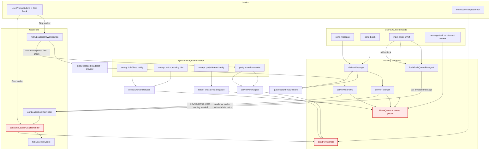

# Crew - Luồng message vào Leader (Goal-related focus)

## Legend
- `M` = qua `PaneQueue.enqueue`, queue-drain semantics.
- `N` = gửi trực tiếp `sendKeys`, bỏ qua queue (không đi qua onQueueDrain).
- `O/P` = state goal `leader_reminder_armed`.

## Các luồng vào leader (thực tế)
1. `send-message`:
   - user command → `deliverMessage` → `deliverToTarget` → `PaneQueue.enqueue`.
   - Nếu target là leader và (`sender=worker` hoặc `metadata.batch_id`) thì gắn `onQueueDrain => armLeaderGoalReminder`.
2. `send-batch`:
   - worker stop message có `batch_id` đi vào `deliverMessage`.
   - Khi batch hoàn tất trong state flow, gọi `queueBatchFinalDelivery` rồi đẩy tới leader bằng `deliverMessage`.
3. `notifyLeadersOnWorkerStop`:
   - từ hook `Stop` của worker nếu không có goal active của worker.
   - Tạo `messages` + preview cho leader.
   - Dùng `deliverWithRetry` -> `PaneQueue.enqueue(skipLeaderPacing, onQueueDrain=armLeaderGoalReminder)`.
4. `flushPushQueueForAgent`:
   - chạy khi unblocking input (`input-block off`) hoặc hook vừa hết blocked.
   - duyệt backlog, enqueue từng message; arm reminder **chỉ** trên message có `sender_role='worker'` hoặc `batch_id != null` mới nhất.
5. `party`/`sweep`/`dialog`:
   - `deliverPartyDigest`, `sweep` idle timeout/idle notify, `notifyPartyTimeout`.
   - `F` permission dialog vào leader qua `sendKeys` trực tiếp.

## Chỗ P2 không ổn định (đã tách rõ)
- P2 có liên quan tới khả năng `onQueueDrain` không chạy nhất quán khi hàng đợi chưa thực sự trống tại đúng thời điểm.
- Đặc biệt khi enqueue cùng lúc nhiều entry (preview, retry, hint/bulk notify…), điều kiện callback chỉ gắn cho phần tử được coi là drain-final nên cờ `leader_reminder_armed` có thể không bật đủ mỗi lần cần.
- Trong chart, các edge qua `M` có dấu hiệu unstable vì phụ thuộc vào queue-drain order.
